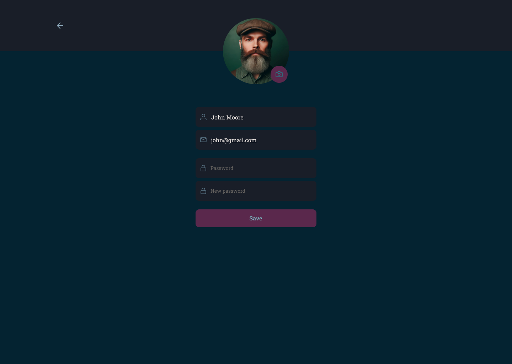

<h1 align="center">
       
    Rocketnotes Web
</h1>

  

  

  
  
  
 
  

   

  

<h4 align="center"> 
	🚀 Application completed 🚀
</h4>

 <a href="#-about">About</a> |
 <a href="#-layout">Layout</a> | 
 <!-- <a href="#-deploy">Deploy</a> | -->
 <a href="#-how-it-works">How It Works</a> | 
 <a href="#-technologies">Technologies</a> | 
 <a href="#-author">Author</a> | 
 <a href="#-license">License</a>

## 💻 About

Rocketnotes is a web application in which users can register and create organized notes on certain subjects, adding a title, description, links and tags to each note, as well as editing the user's profile, being able to change their avatar, name, email and password.

It's worth mentioning that this project is part of the Explorer trail/course offered by Rocketseat to anyone interested.

---

## 🎨 Layout

You can view the project layout via <a href="https://www.figma.com/file/ePICXYr6qQFPFHEttHlDvs/Rocketnotes?type=design&node-id=0-1&mode=design&t=qQju3Z5zkS3Yhkjs-0" target="_blank">link</a>.
 
</img> </img> </img>

</img>  </img> </img>

## 🧰 How it works

This project contains Front-end (React) and Back-end (Node) parts, however, this repository only contains the Front-end Web part, to access the Back-end repository go to the following <a href="https://github.com/afsilvaluiz/rocketnotes-backend" target="_blank">link</a>.

## 🛠 Technologies

The following tools were used to build the project:

#### *Website* ([Vite](https://vitejs.dev/)  +  [React](https://react.dev/))

-   *[Styled-Components](https://styled-components.com/)*
-   *[React-Query](https://react-query-v3.tanstack.com/)*
-   *[React-Icons](https://react-icons.github.io/react-icons/)*
-   *[React-Router-DOM](https://reactrouter.com/en/main/start/tutorial)*

> For more details on the application's general dependencies, see the file [package.json](https://github.com/afsilvaluiz/rocketnotes-frontend/blob/main/package.json).

## 🧑🏻‍💻 Author

 

## 📝 License

This project is under the MIT license. See the [LICENSE](./LICENSE) file for more information

Made with 💜 by Luiz Silva 👋🏽