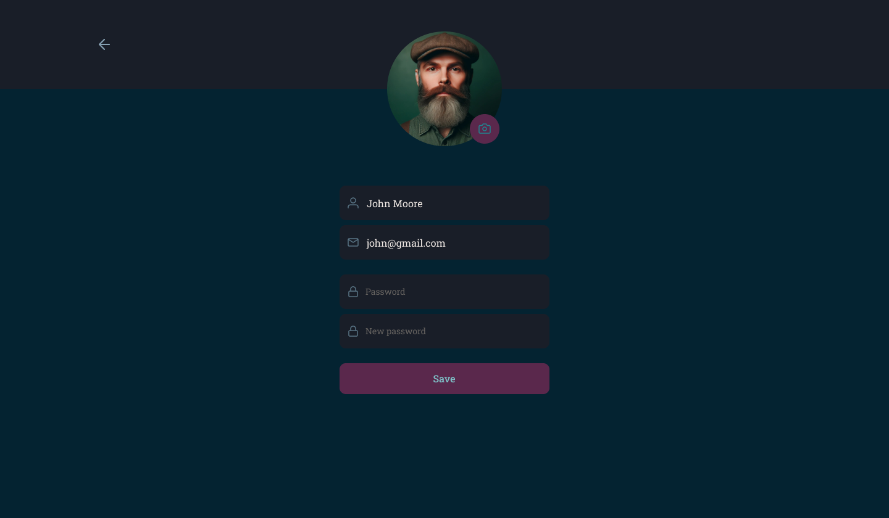
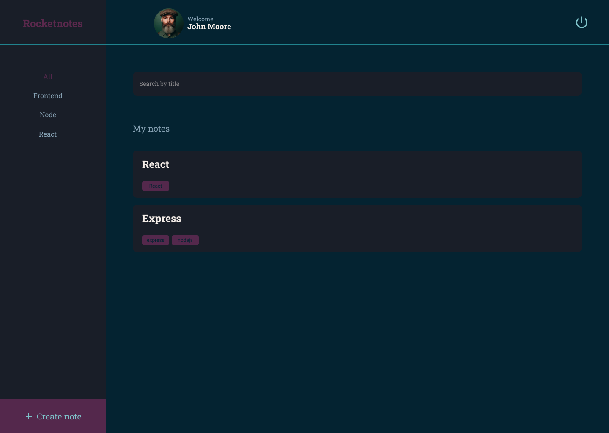
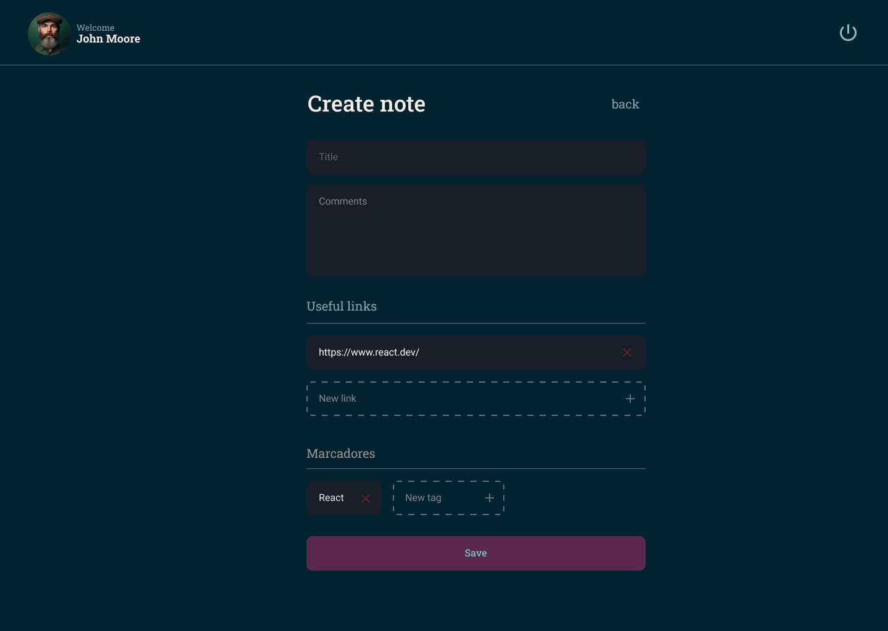
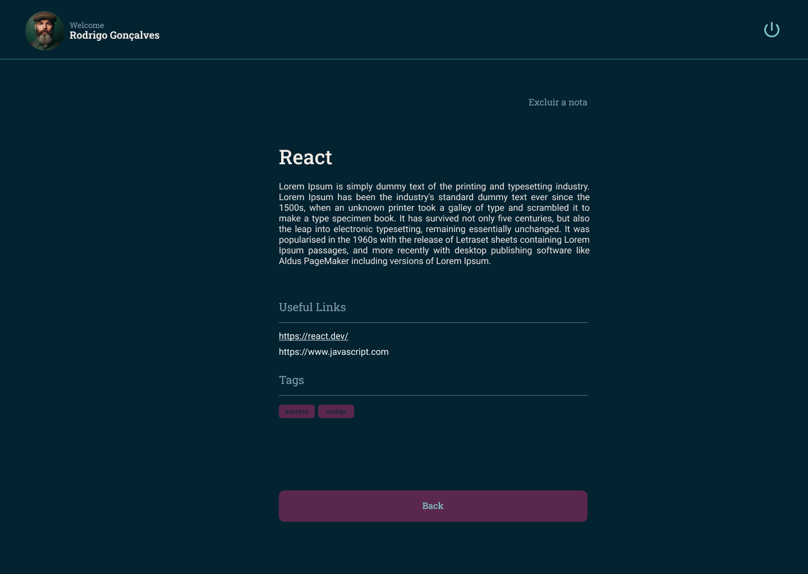

<h1 align="center">
       
    Rocketnotes Web
</h1>

  

  

  
  
  
 
  

   

  

<h4 align="center"> 
	🚀 Application completed 🚀
</h4>

## 💻 About

Rocketnotes is a web application in which users can register and create organized notes on certain subjects, adding a title, description, links and tags to each note, as well as editing the user's profile, being able to change their avatar, name, email and password.

It's worth mentioning that this project is part of the Explorer trail/course offered by Rocketseat to anyone interested.

---

## 🎨 Layout

### Web
 
 
</img> </img> </img>

</img>  </img> </img>
