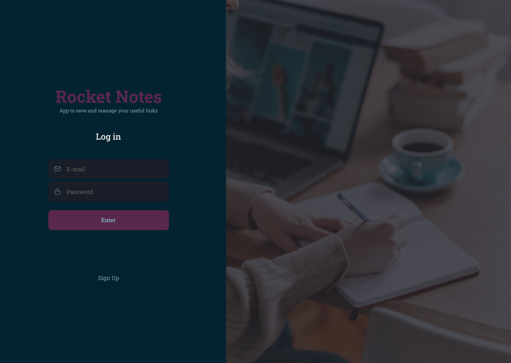

<h1 align="center">
       
    Rocketnotes Web
</h1>

<p align="center">
  

  

  
  
  <a href="https://github.com/afsilvaluiz/rocketnotes-frontend/commits/master">
    
  </a>
 
  

   <a href="https://github.com/afsilvaluiz/rocketnotes-frontend/stargazers">
    
  </a>
</p>

<p>
  
</p>

<h4 align="center"> 
	🚀 Application completed 🚀
</h4>

<p align="center">
 <a href="#-about">About</a> |
 <a href="#-layout">Layout</a> | 
 <a href="#-deploy">Deploy</a>
 <a href="#-how-it-works">How It Works</a> | 
 <a href="#-technologies">Technologies</a> | 
 <a href="#-author">Author</a> | 
 <a href="#-license">License</a>
</p>

## 💻 About

Rocketnotes is a web application in which users can register and create organized notes on certain subjects, adding a title, description, links and tags to each note, as well as editing the user's profile, being able to change their avatar, name, email and password.

It's worth mentioning that this project is part of the Explorer trail/course offered by Rocketseat to anyone interested.

---

## 🎨 Layout

You can view the project layout via <a href="https://www.figma.com/file/ePICXYr6qQFPFHEttHlDvs/Rocketnotes?type=design&node-id=0-1&mode=design&t=qQju3Z5zkS3Yhkjs-0" target="_blank">link</a>.
 
</img> </img> </img>

</img>  </img> </img>

## 🔗 Deploy

To access the application's website deployment, click on the following link: [Link](https://minerocketnotes.netlify.app/)

> Note: the application may take a while to start running after a while, due to the back-end running through the free plan on the hosting platform.


## 🧰 How it works

This project contains Front-end (React) and Back-end (Node) parts, however, this repository only contains the Front-end Web part, to access the Back-end repository go to the following <a href="https://github.com/afsilvaluiz/rocketnotes-backend" target="_blank">link</a>.

### Requirements

Before downloading the project you will need to have the following tools installed on your machine:

* [Git](https://git-scm.com)
* [NodeJS](https://nodejs.org/en/)
* [Yarn](https://yarnpkg.com/) or [NPM](https://www.npmjs.com/)

> Note: and don't forget that you also need to run the application's back-end to fetch and check the necessary data

```bash
# Clone this repository
$ git clone git@github.com:afsilvaluiz/rocketnotes-backend.git

# Access the project folder in the terminal/cmd
$ cd rocketnotes-backend

# Go to the server folder
$ cd server

# Install the dependencies
$ npm install

# Run the application in development mode
$ npm run dev

# The server will start on port:3333 - go to http://localhost:3333 
``` -->

#### 🧭 Running the web application (Frontend)

```bash
# Clone this repository
$ git clone git@github.com:afsilvaluiz/rocketnotes-frontend.git

# Go to the Front End application folder
$ cd rocketnotes-frontend

# Install the dependencies
$ npm install

# Run the application in development mode
$ npm run dev

# The application will be opened on a port specified in the run terminal
```

## 🛠 Technologies

The following tools were used to build the project:

#### *Website* ([Vite](https://vitejs.dev/)  +  [React](https://react.dev/))

-   *[Styled-Components](https://styled-components.com/)*
-   *[React-Query](https://react-query-v3.tanstack.com/)*
-   *[React-Icons](https://react-icons.github.io/react-icons/)*
-   *[React-Router-DOM](https://reactrouter.com/en/main/start/tutorial)*

> For more details on the application's general dependencies, see the file [package.json](https://github.com/afsilvaluiz/rocketnotes-frontend/blob/main/package.json).

## 🧑🏻‍💻 Author

 


## 📝 License

This project is under the MIT license. See the [LICENSE](./LICENSE) file for more information

Made with 🎓 by Luiz Silva 🧑🏻‍💻